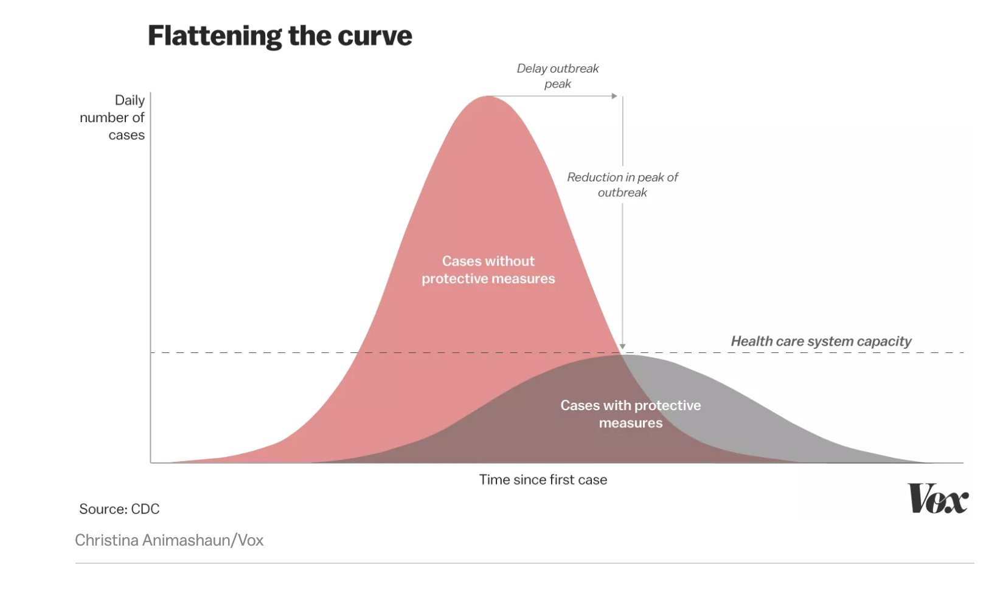
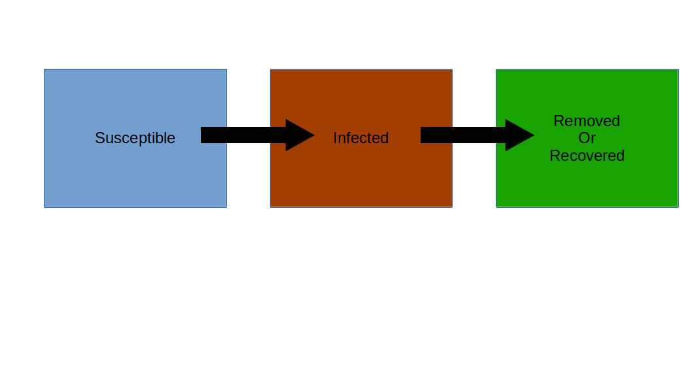
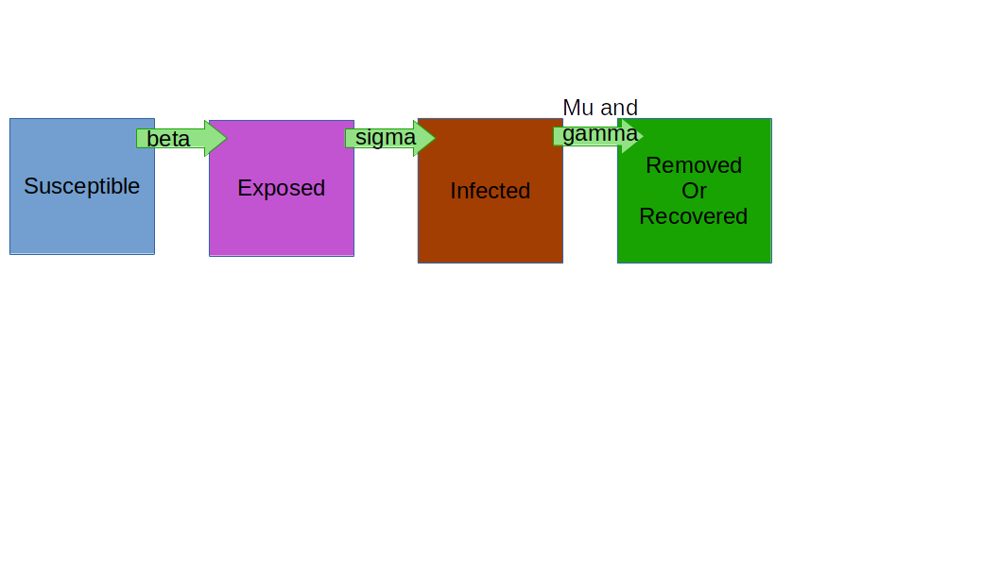

```{r setup, include=FALSE}
knitr::opts_chunk$set(echo = TRUE)
```

# Flattening The Curve




"Flattening the curve" refers to slowing the progression of a disease. The same amount of people may become ill, but more slowly. The disease isn't the only problem - the number of ventilators, hospital beds, and doctor protective equipment - all need to be rationed. The horizontal line on the screen is the capacity of the healthcare industry. We're in the Baton Rouge hospital district. For us, this is 277 ventilators and 338 ICU beds (from [the Advocate](https://www.theadvocate.com/baton_rouge/news/coronavirus/article_7e8cde6c-6887-11ea-b06a-1b3c98b77668.html)). 

# Disease Modeling: SIR model

SIR models are a simple class of models which describe the rate of change of susceptible, infected, and recovered individuals in a mixing population with a disease. 



Individuals who are *susceptible* can catch the illness. *Infected* individuals have the disease. This can mean that they are asymptomatic (not showing symptoms), pre-symptomatic (have no symptoms but will become sick), or symptomatic (ill and displaying illness). Infected individuals can transmit the illness. Individuals who are *recovered* have been ill, and recovered. *Removed* individuals have died. In either case, removed/recovered individuals are assumed not to be able to transmit the illness. This is one of the simplest models of epidemics.

# SEIR model

One modification of the SIR model splits infected from *exposed*. Someone who is exposed may carry the disease, but not move fully into the infected state. 



This model is known to be a better fit for Coronavirus, as there are cases of individuals being exposed but not developing the illness. Today, we will look at various scenarios of the spread of the disease.


```{r}
install.packages('EpiDynamics')
library(EpiDynamics)
```

First, we will set up the parameters governing how people move between states. 

```{r}
library(EpiDynamics)
parameters <- c(mu = 1 / (70 * 365), beta = 500 / 365,
                sigma = 1 / 14, gamma = 1 / 7)

```

*Mu* is the background death rate, i.e., how many people will be lost from the population in a year normally. In the US, this is 1/(70 * 365). This is a per capita rate - the probability of any one individual being removed. *Beta* is the transmission rate, or how many individuals will be infected by an infected person. *Sigma* is the rate of movement from exposed to infectious. For coronavirus, this seems to be about 14 days. *Gamma*, the recovery rate is how long one is sick for. We've set this to an infectious person recovering in 7 days.


Now, we will choose our other parameters. We will say that 90% of individuals are susceptible, .01 have been exposed, one in 1000 have been infected, and recovery is equal to one minus all three values. We will run our model for 180 days.
```{r}
initials <- c(S = 0.6, E = .01, I = .001, R = 1 - 0.9 - .01 - .001) 
seir <- SEIR(pars = parameters, init = initials, time = 0:180)
PlotMods(seir)
```

# Exploration:

    2. Run the code above. 
        a. When does the peak occur (if time is in days)? 
        b. What fraction of the population is exposed at that time?
        c. What fraction of the population is infected at that time?

Group One: 
  Change the code to have a beta value of 200/365 and re-run the simulation. 
        a. When does the peak occur (if time is in days)? 
        b. What fraction of the population is exposed at that time?
        c. What fraction of the population is infected at that time?
        d. What does this scenario mean, biologically?
        
Group Two: 
  Change the code to have a beta value of 800/365 and re-run the simulation. 
        a. When does the peak occur (if time is in days)? 
        b. What fraction of the population is exposed at that time?
        c. What fraction of the population is infected at that time?
        d. What does this scenario mean, biologically?
        
Group Three: 
  Change the code to have a gamma value of 1/14 and re-run the simulation. 
        a. When does the peak occur (if time is in days)? 
        b. What fraction of the population is exposed at that time?
        c. What fraction of the population is infected at that time?
        d. What does this scenario mean, biologically?

Group Four: 
  Change the code to have a sigma value of 1/21 and re-run the simulation. 
        a. When does the peak occur (if time is in days)? 
        b. What fraction of the population is exposed at that time?
        c. What fraction of the population is infected at that time?
        d. What does this scenario mean, biologically?
        
Group Five: 
  Change the code to have a susceptible value of .65 and re-run the simulation. 
        a. When does the peak occur (if time is in days)? 
        b. What fraction of the population is exposed at that time?
        c. What fraction of the population is infected at that time?
        d. How could we get a susceptible value this low?
        
Group Six: 
  Change the code to have an infected value based on today's number of positive cases and re-run the simulation. 
        a. When does the peak occur (if time is in days)? 
        b. What fraction of the population is exposed at that time?
        c. What fraction of the population is infected at that time?
        d. Do you think this scenario is likely?
        
Group Seven: 
  One of the dangers of a pandemic is that other non-COVID illnesses might not be able to get medical treatment. Change the mu parameter to reflect this. 
        a. When does the peak occur (if time is in days)? 
        b. What fraction of the population is exposed at that time?
        c. What fraction of the population is infected at that time?

                
Lesson based on [EpiDynamic modeling](https://qubeshub.org/qubesresources/publications/1763/1) by Carrie Diaz-Eaton.
        

